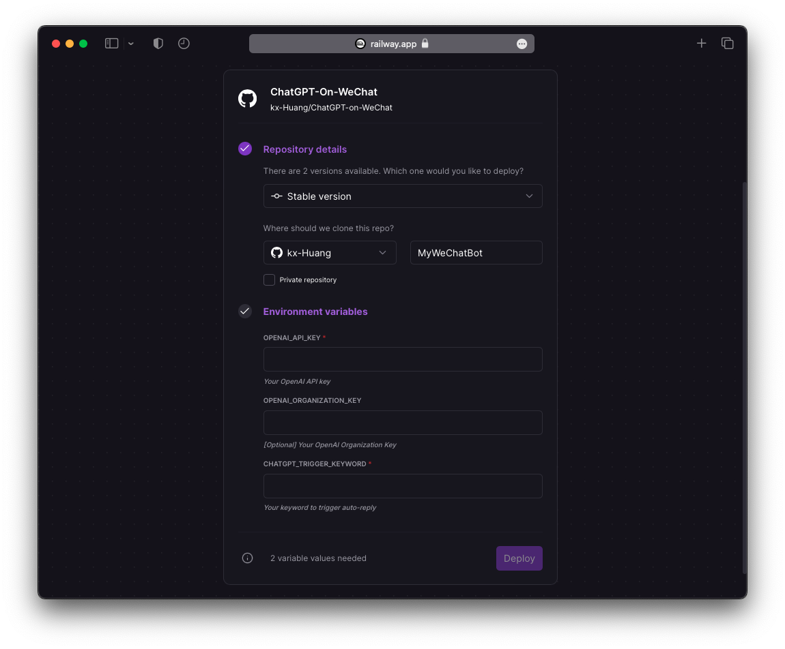
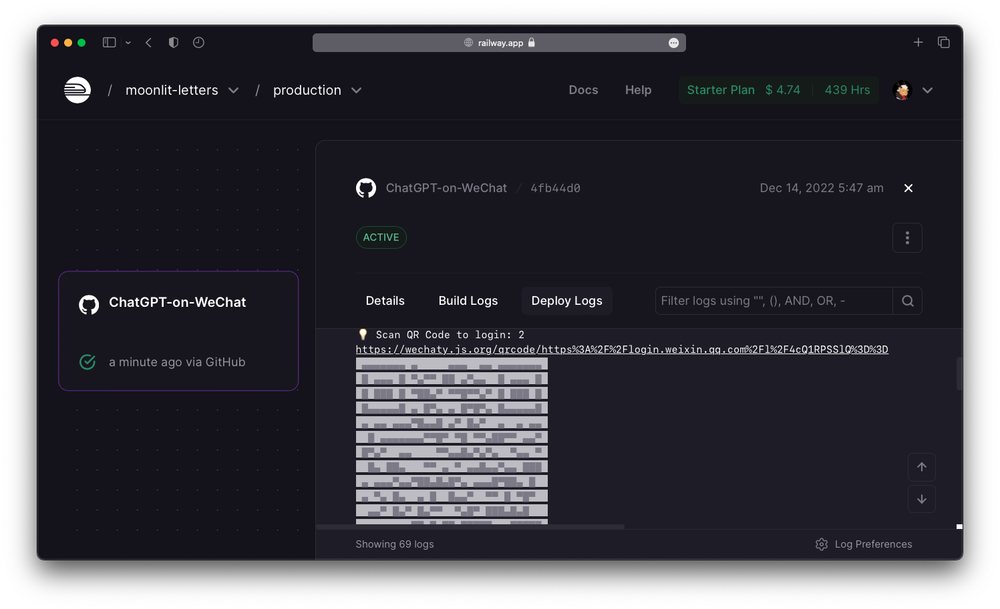

# OpenAI on WeChat   [](https://wakatime.com/badge/user/7d2c2fc8-bd1d-4e1e-bb2b-b49c6120ed53/project/205c561e-69ba-4478-b07f-f5bc7a0ed394)  <!-- omit in toc -->

🤖️ Turn your WeChat into an auto-reply chatbot powered by OpenAI [**within only 2 steps!**](#12-deploy-on-cloud) 🤖️


## Acknowledgement & Features <!-- omit in toc -->

This project is implemented based on [this amazing project](https://github.com/fuergaosi233/wechat-chatgpt) that I contibuted before, with [`Wechaty SDK`](https://github.com/wechaty/wechaty) and `OpenAI API Key`, we achieve:

- fast and robust connection to dozens of `AI model` with different features
- stable and persistent deployment on cloud servers `Railway`

## 0. Table of Content <!-- omit in toc -->

- [1. How to Deploy this Bot?](#1-how-to-deploy-this-bot)
  - [1.1 Deploy in Local](#11-deploy-in-local)
    - [1.1.1 Get your OpenAI API Keys](#111-get-your-openai-api-keys)
    - [1.1.2 Configure Environment Variables](#112-configure-environment-variables)
    - [1.1.3 Setup the Docker](#113-setup-the-docker)
    - [1.1.4 Login your WeChat](#114-login-your-wechat)
  - [1.2 Deploy on Cloud](#12-deploy-on-cloud)
    - [1.2.1 Configure on `Railway`](#121-configure-on-railway)
    - [1.2.2 Deploy \& Login on `Railway`](#122-deploy--login-on-railway)
- [2. Any Fancy Advanced Settings?](#2-any-fancy-advanced-settings)
  - [2.1 Config Reply in Error](#21-config-reply-in-error)
  - [2.2 Config `OpenAI` Models](#22-config-openai-models)
  - [2.3 Config Model Features](#23-config-model-features)
  - [2.4 Add Customized Task Handler](#24-add-customized-task-handler)
- [3. How to Contribute to this Project?](#3-how-to-contribute-to-this-project)

## 1. How to Deploy this Bot?

You can deploy **in local** or **on cloud**,  whatever you want.

The [deploy on cloud](#12-deploy-on-cloud) method is recommended.

### 1.1 Deploy in Local

#### 1.1.1 Get your OpenAI API Keys

- `openaiApiKey` can be generated in the [**API Keys Page** in your OpenAI account](https://beta.openai.com/account/api-keys)
- `openaiOrganizationID` is optional, which can be found in the [**Settings Page** in your Open AI account](https://beta.openai.com/account/org-settings)

---

#### 1.1.2 Configure Environment Variables

You can copy the template `config.yaml.example` into a new file `config.yaml`, and paste the configurations:

```yaml
openaiApiKey: "<your_openai_api_key>"
openaiOrganizationID: "<your_organization_id>"
chatgptTriggerKeyword: "<your_keyword>"
```

Or you can export the environment variables listed in `.env.sample` to your system, which is a more encouraged method to keep your `OpenAI API Key` safe:

```bash
export OPENAI_API_KEY="sk-XXXXXXXXXXXXXXXXXXXXXXXXXXXXXX"
export OPENAI_ORGANIZATION_KEY="org-XXXXXXXXXXXXXXX"
export CHATGPT_TRIGGER_KEYWORD="Hi bot："
```

**Please note:**

- `chatgptTriggerKeyword` is the keyword which can trigger auto-reply:
  - In private chat, the message **starts with** it will trigger auto-reply
  - In group chat, the message **starts with** `@Name <keyword>` will trigger auto-reply (Here `@Name ` means "@ the bot" in the group chat)
- `chatgptTriggerKeyword` can be **empty string**, which means:
  - In private chat, **every messages** will trigger auto-reply
  - In group chat, only **"@ the bot"** will trigger auto-reply

---

#### 1.1.3 Setup the Docker

1. Setup Docker Image

```bash
docker build -t openai-on-wechat .
```

2. Setup Docker Container

```bash
docker run -v $(pwd)/config.yaml:/app/config.yaml openai-on-wechat
```

---

#### 1.1.4 Login your WeChat

Once you deploy the bot successfully, just follow the `terminal` or `Logs` in Docker container prompt carefully:

1. Scan the QR Code with mobile WeChat
2. Click "Log in" to allow desktop login (where our bot stays)
3. Wait a few seconds and start chatting!

🤖 **Enjoy your powerful chatbot!** 🤖

---

### 1.2 Deploy on Cloud

Click the button below to fork this repo and deploy with Railway!

[](https://railway.app/new/template/zKIfYk?referralCode=D6wD0x)

---

#### 1.2.1 Configure on `Railway`

Fill in the following blanks:

1. Your forked repo name (can be any name you like)
2. Choose make it private or not (also up to you)
3. Environment variables (for how to get OpenAI API keys, please refer to [1.1.1 Get your OpenAI API Keys](#111-get-your-openai-api-keys)



**Please note:**

Make sure the environment variables are set in RailWay instead of writing directly in `config.yaml`. It's really **NOT** recommended to implicitly write out your `OpenAI API Key` in public repo. Anyone with your key can get access to the OpenAI API services, and it's possbile for you to lose money if you pay for that.

---

#### 1.2.2 Deploy & Login on `Railway`

The deploy process is automatic. It may take a few minutes for the first time. As you see the `Success`, click the tab to see the details. (which is your secret WeChat console!)


Click `Deply Logs` and you will see everything is setting up, wait for a QR Code to pop up. Scan it as if you are login to your desktop WeChat, and click "Log in" on your mobile WeChat.



Finally, everything is good to go! You will see the logs when people sending you messagem, and whenever the chatbot is auto-triggered to reply.


🤖 **Enjoy your powerful chatbot!** 🤖

## 2. Any Fancy Advanced Settings?

### 2.1 Config Reply in Error

When the OpenAI API encounters some errors (e.g. over-crowded traffic, no authorization, ...), the chatbot will auto-reply the pre-configured message.

You can change it in `src/chatgpt.js`:

```typescript
const chatgptErrorMessage = "🤖️：AI机器人摆烂了，请稍后再试～";
```

---

### 2.2 Config `OpenAI` Models

You can change whatever `OpenAI` Models you like to handle task at different capability & time-consumption trade-off. (e.g. model with better capability costs more time to respond)

Currently, we use the latest `text-davinci-003` model, which is:

> Most capable GPT-3 model. Can do any task the other models can do, often with higher quality, longer output and better instruction-following. Also supports inserting completions within text.

Also, for the same model, we can configure dozens of parameter (e.g. answer randomness, maximum word limit...). For example, for the `temperature` field:

> Higher values means the model will take more risks. Try 0.9 for more creative applications, and 0 (argmax sampling) for ones with a well-defined answer.

You can configure all of them in `src/chatgpt.js`:

```typescript
const ChatGPTModelConfig = {
  // this model field is required
  model: "text-davinci-003",
  // add your OpenAI model parameters below
  temperature: 0.3,
  max_tokens: 2000,
};
```

For more details, please refer to [OpenAI Models Doc](https://beta.openai.com/docs/models/overview).

---

### 2.3 Config Model Features

You can change whatever features you like to handle different types of tasks. (e.g. complete text, edit text, generate code...)

Currently, we use `createCompletion()` to generate or manipulate text for daily usage, which:

> Creates a completion for the provided prompt and parameters

You can configure in `src/chatgpt.js`:

```typescript
const response = await this.OpenAI.createCompletion({
  ...ChatGPTModelConfig,
  prompt: inputMessage,
});
```

Of course you can ask how to edit text in current mode, but the outcome may fall short of expectations.

For more details, please refer to [OpenAI API Doc](https://beta.openai.com/docs/api-reference/introduction).

---

### 2.4 Add Customized Task Handler

You can add your own task handlers to expand the ability of this chatbot!

Currently, add task handler in `src/main.ts`:

```typescript
// e.g. if a message starts with "Hello", the bot sends "World!"
if (message.text().startsWith("Hello")) {
  await message.say("World!");
  return;
}
```

Of course, stuffing all handlers in `main` function is really a **BAD** habit in coding. As a result, we will fix this in future updates to do logic separation.

## 3. How to Contribute to this Project?

You can raise some issues, fork this repo, commit your code, submit pull request, and after code review, we can merge your patch. I'm really looking forward to develop more interesting features!
