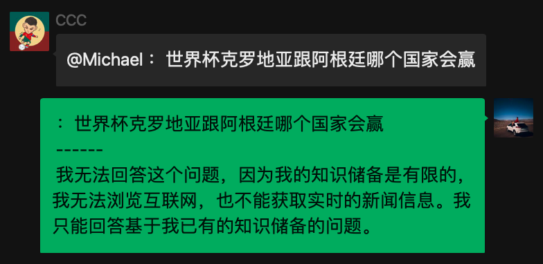
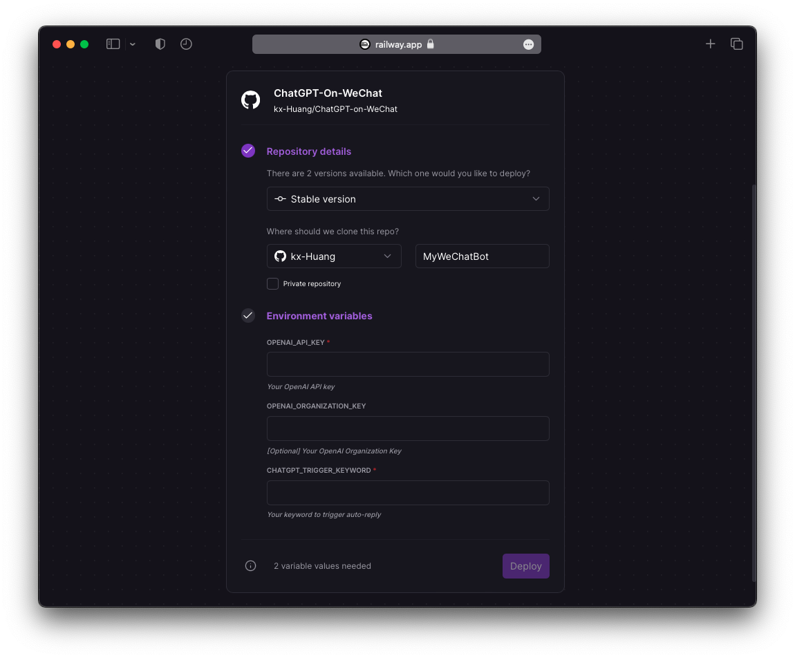
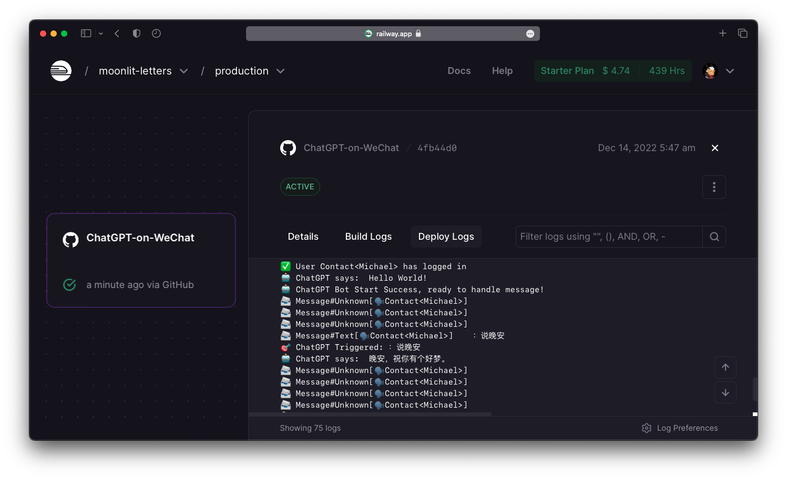

# OpenAI on WeChat   [](https://wakatime.com/badge/user/7d2c2fc8-bd1d-4e1e-bb2b-b49c6120ed53/project/205c561e-69ba-4478-b07f-f5bc7a0ed394)  <!-- omit in toc -->

🤖️ [**只需2 个步骤**](#12-deploy-on-cloud)将您的微信变成由 OpenAI 提供支持的自动回复聊天机器人！ 🤖️
> [English](README.md) | 中文文档



## 致谢和功能 <!-- omit in toc -->

这个项目是基于我之前使用 [`Wechaty SDK`](https://github.com/wechaty/wechaty) 贡献的[这个惊人的项目](https://github.com/fuergaosi233/wechat-chatgpt), 我们实现了：`OpenAI API Key`

- 快速而强大的连接数十种具有不同功能`AI model`
- 在云服务器上稳定持久部署`Railway`

## 0. 目录 <!-- omit in toc -->

- [1. 如何部署此机器人?](#1-how-to-deploy-this-bot)
  - [1.1 在本地部署](#11-deploy-in-local)
    - [1.1.1 获取您的 OpenAI API 密钥](#111-get-your-openai-api-keys)
    - [1.1.2 配置环境变量](#112-configure-environment-variables)
    - [1.1.3 设置 Docker](#113-setup-the-docker)
    - [1.1.4 登录你的WeChat](#114-login-your-wechat)
  - [1.2 在云上部署](#12-deploy-on-cloud)
    - [1.2.1 在 `Railway` 上配置](#121-configure-on-railway)
    - [1.2.2 在 `Railway` 上部署和登录](#122-deploy--login-on-railway)
- [2. 有什么花哨的高级设置吗?](#2-any-fancy-advanced-settings)
  - [2.1 配置回复错误](#21-config-reply-in-error)
  - [2.2 配置 `OpenAI` 模型](#22-config-openai-models)
  - [2.3 配置模型特性](#23-config-model-features)
  - [2.4 添加自定义任务处理程序](#24-add-customized-task-handler)
- [3. 如何为这个项目做出贡献?](#3-how-to-contribute-to-this-project)

## 1. 如何部署此机器人？

您可以随心所欲地在**本地**或**云中**部署。

建议使用[在云上部署](#12-deploy-on-cloud)的方法 。

### 1.1 在本地部署

#### 1.1.1 获取您的 OpenAI API 密钥

- `openaiApiKey` 可以在 [您的OpenAI账户的**API 密钥页面**](https://beta.openai.com/account/api-keys)中生成
- `openaiOrganizationID` 是可选的，可以在 [您的OpenAI账户的**设置页面** ](https://beta.openai.com/account/org-settings)中找到

---

#### 1.1.2 配置环境变量

你可以复制模板 `config.yaml.example` 到一个新文件 `config.yaml`中, 然后粘贴配置:

```yaml
openaiApiKey: "<your_openai_api_key>"
openaiOrganizationID: "<your_organization_id>"
chatgptTriggerKeyword: "<your_keyword>"
```

或者，您可以将列出的环境变量导出 `.env.sample` 到你的系统中, 这是一种更鼓励的方法，可以确保您的 `OpenAI API Key` 安全:

```bash
export OPENAI_API_KEY="sk-XXXXXXXXXXXXXXXXXXXXXXXXXXXXXX"
export OPENAI_ORGANIZATION_KEY="org-XXXXXXXXXXXXXXX"
export CHATGPT_TRIGGER_KEYWORD="机器人你好："
```

**请注意:**

- `chatgptTriggerKeyword` 是可以触发自动回复的关键字：
  - 在私聊中，以它**开头**的消息将触发自动回复
  - 在群聊中，消息**开头** `@Name <keyword>` 将触发自动回复（此处表示群聊中的“@机器人”）
- `chatgptTriggerKeyword` 可以是**空字符串**，这意味着：
  - 在私聊中，**每条消息都会**触发自动回复
  - 在群聊中，只有 **"@ the bot"** 会触发自动回复

---

#### 1.1.3  设置 Docker

1. 设置 Docker 镜像

```bash
docker build -t openai-on-wechat .
```

2. 设置 Docker 容器

```bash
docker run -v $(pwd)/config.yaml:/app/config.yaml openai-on-wechat
```

---

#### 1.1.4 登录您的 WeChat

成功部署机器人后，只需仔细按照 `terminal` 或者 `Logs` 在Docker 容器提示进行操作：

1. 使用手机微信扫描二维码
2. 单击“登录”以允许桌面登录（我们的机器人所在的位置）
3. 等待几秒钟，开始聊天！

🤖 **享受您强大的聊天机器人!** 🤖

---

## 安装

```cmd
npm config set puppeteer_download_host=https://npm.taobao.org/mirrors
npm install
npm run dev
```

### 1.2 在云上部署

单击下面的按钮分叉此存储库并使用铁路进行部署！

[](https://railway.app/new/template/zKIfYk?referralCode=D6wD0x)

---

#### 1.2.1 在 `Railway` 上配置

填写以下空白：

1. 您的分叉存储库名称（可以是你喜欢的任何名称）
2. 选择是否将其设为私有（也取决于您）
3. 环境变量 (如何获取 OpenAI API 密钥，请参考 [1.1.1 获取您的 OpenAI API 密钥](#111-get-your-openai-api-keys)



**请注意：**

确保环境变量是在 RailWay 中设置的，而不是直接写入 `config.yaml`。真的**不**建议隐式写出您的 `OpenAI API Key` 在公共存储库中.。任何拥有您的密钥的人都可以访问OpenAI API服务，如果您为此付费，您可能会赔钱。

---

#### 1.2.2 部署 & 登录 `Railway`

部署过程是自动的。第一次可能需要几分钟。如果您看见 `Success`, 单击选项卡以查看详细信息。（这是你的秘密微信控制台！）


点击 `Deply Logs` 您将看到一切都已设置，等待QR码弹出。扫描它就像您登录到您的桌面微信一样，然后在您的移动微信上单击“登录”。


终于，一切都好了！当人们向您发送消息时，以及每当聊天机器人自动触发回复时，您都会看到日志。



🤖 **享受您强大的聊天机器人！**🤖

## 2. 有什么花哨的高级设置吗？

### 2.1 配置回复错误

当 OpenAI API 遇到一些错误（例如流量过度拥挤、没有授权等）时，聊天机器人将自动回复预先配置的消息。

您可以在以下位置更改它 `src/chatgpt.js`:

```typescript
const chatgptErrorMessage = "🤖️：AI机器人摆烂了，请稍后再试～";
```

---

### 2.2 配置 `OpenAI` 模型

您可以更改您喜欢处理任务的任何 `OpenAI` 模型，以不同的能力和时间消耗权衡。（例如，具有更好功能的模型需要花费更多时间来响应）

目前，我们使用最新的 `text-davinci-003` 模型，即：

> 功能最强大的 GPT-3 模型。可以完成其他模型可以完成的任何任务，通常具有更高的质量、更长的输出和更好的指令遵循。还支持在文本中插入补全。

此外，对于同一模型，我们可以配置数十个参数（例如答案随机性、最大字数限制......例如，对于 `temperature` 字段：

> 值越高意味着模型将承担更多风险。对于更具创造性的应用程序，请尝试 0.9，对于具有明确定义答案的应用程序，请尝试 0（argmax 采样）。

您可以配置所有这些在 `src/chatgpt.js`中:

```typescript
const ChatGPTModelConfig = {
  // this model field is required
  model: "text-davinci-003",
  // add your OpenAI model parameters below
  temperature: 0.3,
  max_tokens: 2000,
};
```

有关更多详细信息，请参阅 [OpenAI Models Doc](https://beta.openai.com/docs/models/overview).

---

### 2.3 配置模型特性

您可以更改您喜欢的任何功能来处理不同类型的任务。（例如，完成文本，编辑文本，生成代码...）

目前，我们使用 `createCompletion()` 生成或操作日常使用的文本, 其中:

> 为提供的提示和参数创建补全

您可以在以下位置进行配置 `src/chatgpt.js`:

```typescript
const response = await this.OpenAI.createCompletion({
  ...ChatGPTModelConfig,
  prompt: inputMessage,
});
```

当然，您可以询问如何在当前模式下编辑文本，但结果可能达不到预期。

有关更多详细信息，请参阅 [OpenAI API Doc](https://beta.openai.com/docs/api-reference/introduction).

---

### 2.4 添加自定义任务处理程序

您可以添加自己的任务处理程序来扩展此聊天机器人的功能！

目前，在以下位置： `src/main.ts` 添加任务处理程序

```typescript
// e.g. if a message starts with "Hello", the bot sends "World!"
if (message.text().startsWith("Hello")) {
  await message.say("World!");
  return;
}
```

当然，将所有处理程序塞进 `main` 函数中确实是编码中的**坏**习惯。因此，我们将在将来的更新中修复此问题以进行逻辑分离。

## 3. 如何为这个项目做出贡献？

您可以提出一些issues, fork 这个存储库, commit 你的代码, 提交 pull 请求, 在代码审查后，我们可以 merge 你您的 patch.。我真的很期待开发更多有趣的功能！
